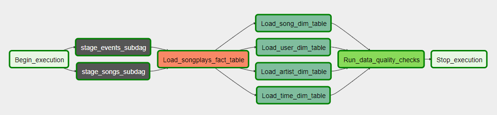

## Summary of the project, how to run the Python scripts, and an explanation of the files in the repository

A music streaming company, Sparkify, has decided that it is time to 
introduce more automation and monitoring to their data warehouse ETL 
pipelines and come to the conclusion that the best tool to achieve this
is Apache Airflow.

The source data resides in S3 and needs to be processed in Sparkify's data warehouse
in Amazon Redshift. The source datasets consist of JSON logs that tell about user activity
in the application and JSON metadata about the songs the users listen to.

Throughout this project I implemented the core concepts of Apache Airflow:
DAGS, Subdags, custom operators to perform different tasks such as staging the data, filling
the data warehouse, and running  check on the data as a final step

### For this project I load datasets from two s3 locations: 

- Song data: s3://udacity-dend/song_data
- Log data: s3://udacity-dend/log_data

### The project template package contains three major components for the project:

1. The main dag file - udac_example_dag
2. The subdag  get_s3_to_redshift_dag; The purpose of this subdag is to keep in the same place and reuse the code 
	which move the data from S3 creating staging tables in the data warehouse, load the data, and after check if any
	record had load.

### The operators folder wich contains the operators
- StageToRedshiftOperator - which load the data from s3 to redshift
- HasRowsOperator - check if at least one record has load in staging tables
- LoadFactOperator - load data from the staging tables to the fact table
- LoadDimensionOperator - load data from the staging tables to dimension table
- DataQualityOperator - Tests the new tables created in the data warehouse have at least one record an the primary keys 
	related to them don't have NULL values

### A helper class for the SQL transformations

## Run the scripts

### 1.Create AWS Reshift Cluster
1. Create a new AWS redshift Cluster using AWS console.
2. Allow instances and devices outside the VPC to connect to your database through the cluster endpoint.

### 2. Interact programatically with AWS services

1. In the Airflow UI create two new connections:
	1. aws_credentials - using AWS IAM credentials and Amazon Web Services connection type
	2. redshift = using the details of the AWS Redshift cluster for the dev schema

### 3. Run the DAG
1. Open Airflow UI by running in command line the following command: 
	- /opt/airflow/start.sh
2. Using the the interface run and monitor the execution of the DAG

